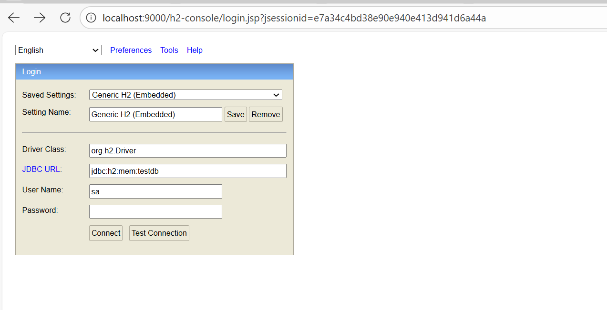
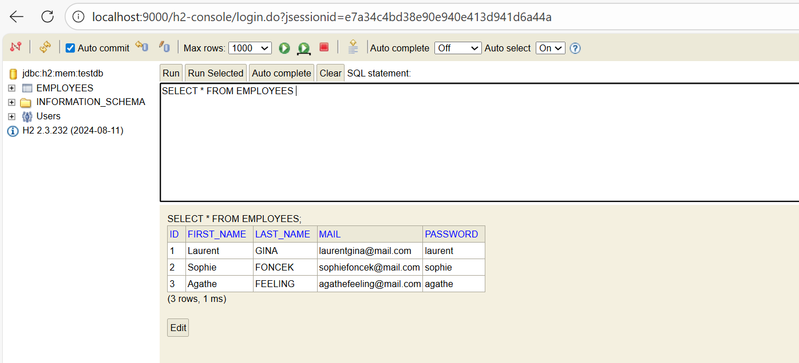
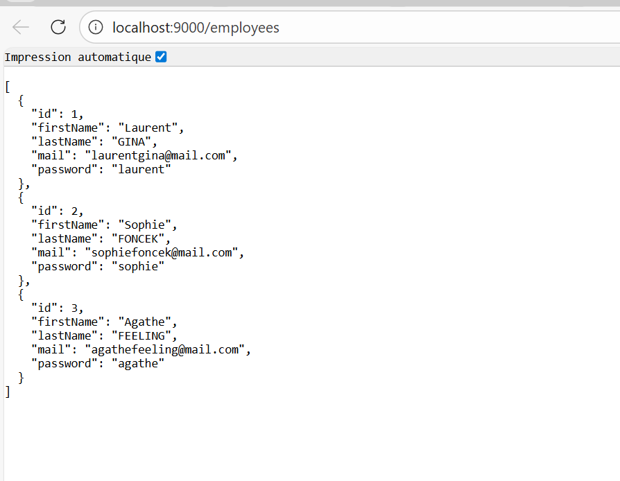
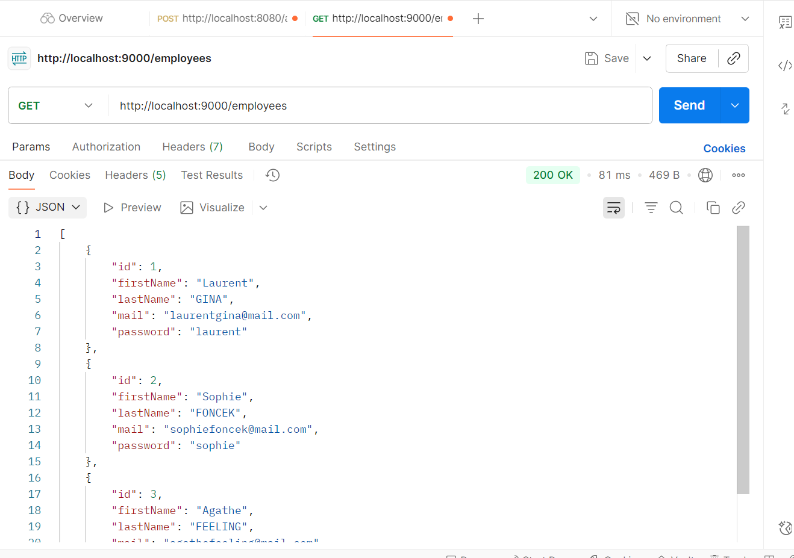
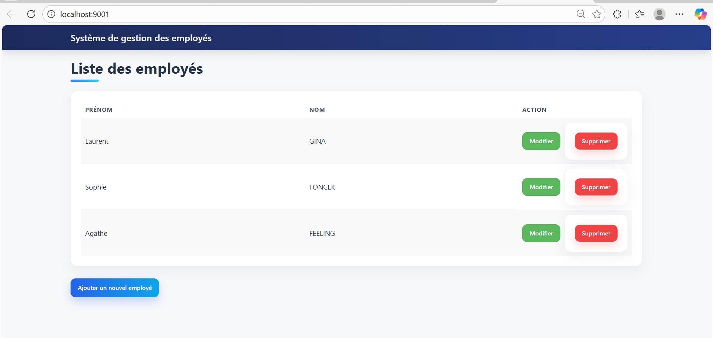
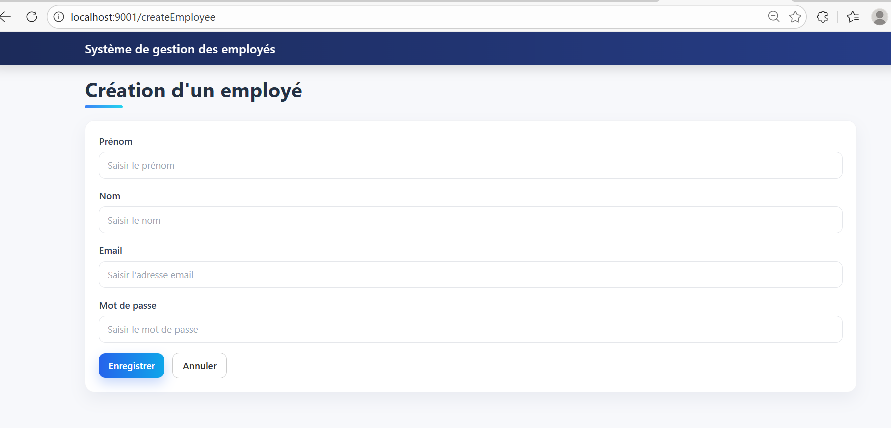
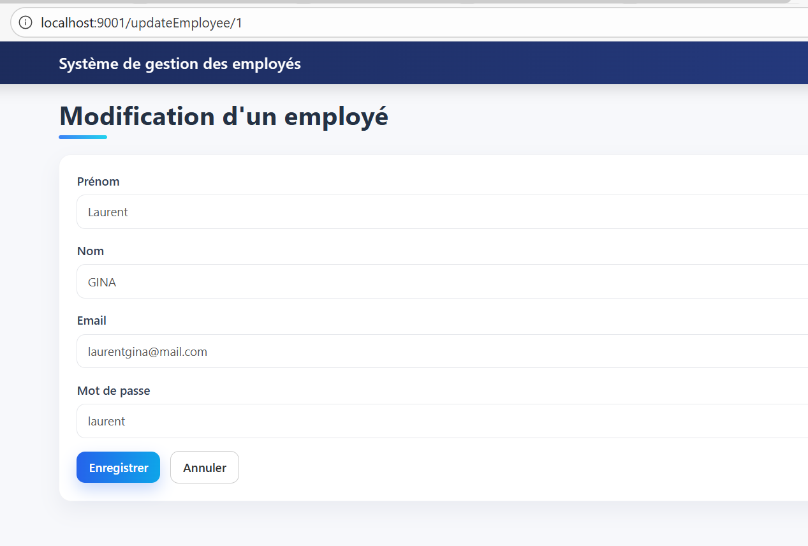
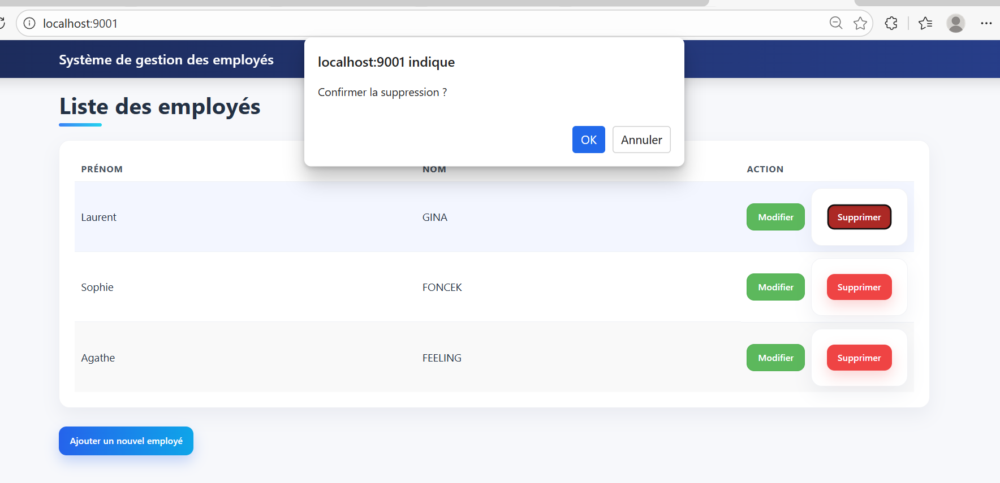

# TP2 – WebApp Spring Boot + Microservice REST API (Gestion des employés)

## Objectif du TP
Dans ce TP, le but est de réaliser une petite application de gestion des employés en deux parties :
- un microservice REST (CRUD employés) avec Spring Boot
- une WebApp Spring Boot (Thymeleaf) qui consomme l’API via RestTemplate
- utilisation de la base H2 (in-memory) pour stocker les données
- tests des opérations CRUD (GET, POST, PUT, DELETE) avec Postman si besoin

## Architecture (principe)
L’utilisateur passe par la WebApp (front) sur le port 9001.  
La WebApp appelle le microservice (API) sur le port 9000.  
Le microservice accède à la base H2. :contentReference[oaicite:0]{index=0}

## Travail réalisé (résumé)
- Microservice EmployeesMngt :
  - modèle Employee + repository + service + controller REST
  - endpoints CRUD (ex : /employees)
  - configuration H2 + console H2
- WebApp :
  - MVC avec Thymeleaf (pages HTML)
  - RestTemplate (EmployeeProxy) pour communiquer avec l’API
  - affichage liste employés + ajout / modification / suppression

## Lancement
1) Démarrer le microservice (port 9000)  
2) Démarrer la WebApp (port 9001)  
3) Tester :
- API : `http://localhost:9000/employees`
- WebApp : `http://localhost:9001/`
- Console H2 : `http://localhost:9000/h2-console`

## Captures d’écran
- Console H2 (connexion + table employees)

- Test /employees dans le navigateur ou Postman

- Démarrage WebApp + port 9001

- Page liste des employés

- Formulaire d’ajout d’un employé

- Modification d’un employé

- Suppression d’un employé

## Résultat obtenu
La WebApp récupère les employés depuis le microservice via RestTemplate et les affiche avec Thymeleaf.
Les opérations CRUD fonctionnent et les données sont stockées dans H2 pendant l’exécution.

## Conclusion
Ce TP m’a permis de comprendre la séparation WebApp / API REST, et la communication entre deux composants via HTTP (RestTemplate), avec persistance H2.
