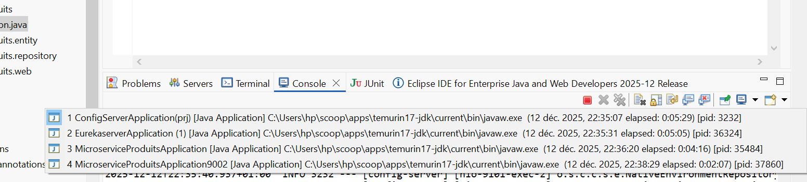
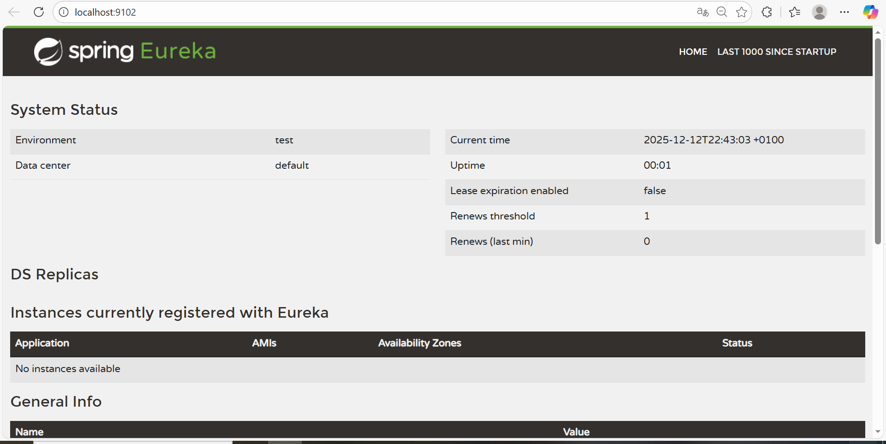
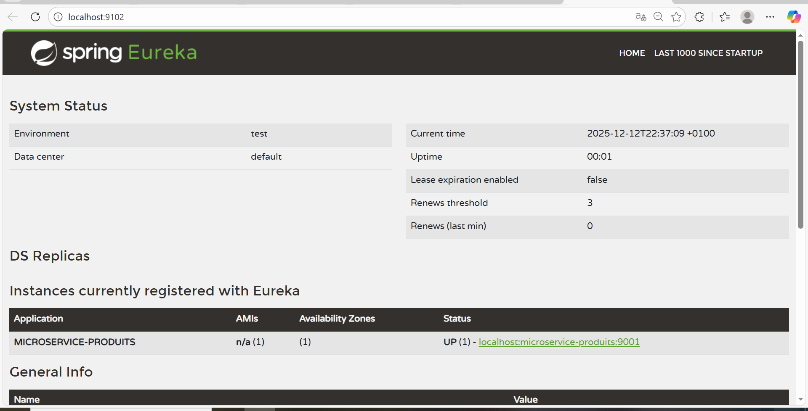
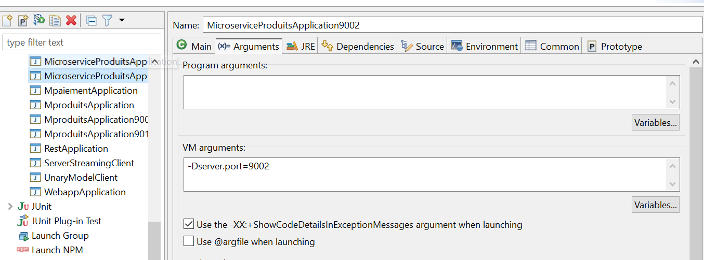
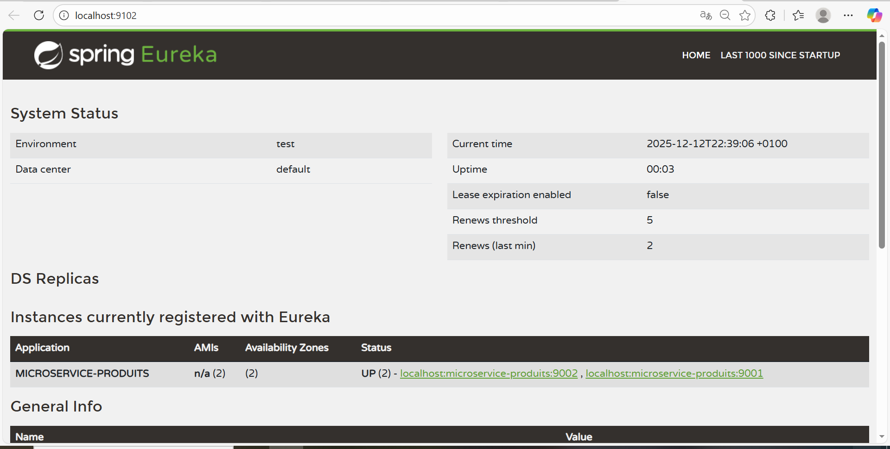

# TP4 – Service Registry & Discovery avec Eureka

## Objectif du TP
Ce TP a pour objectif de mettre en place un serveur Eureka afin de permettre la découverte automatique des microservices.

---

## Travail réalisé
Un serveur Eureka a été configuré avec Spring Cloud.  
Deux instances du microservice Produits ont été lancées sur des ports différents et se sont enregistrées auprès du serveur Eureka.

---

## Architecture
L’architecture repose sur :
- un serveur Eureka
- plusieurs instances d’un même microservice
- une console Eureka pour visualiser les services

---

## Lancement
Le serveur de configuration (Config Server) est démarré en premier afin de charger les configurations centralisées.  
Ensuite, le serveur Eureka est lancé.  
Enfin, les différentes instances du microservice Produits sont démarrées et s’enregistrent automatiquement auprès de Eureka.

---

## Captures d’écran

- Démarrage du serveur Eureka

- Console Eureka

- Première instance du microservice

- Ajout d’une deuxième instance

- Deuxième instance du microservice

---

## Résultat obtenu
Les deux instances du microservice Produits apparaissent correctement dans la console Eureka avec leurs ports respectifs.

---

## Conclusion
Ce TP permet de comprendre le principe de Service Discovery et le rôle de Eureka dans une architecture microservices.
