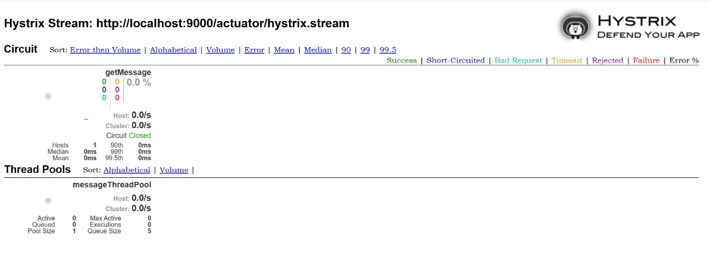
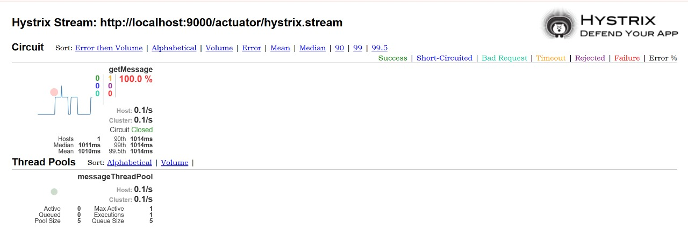

# TP6 – Résilience des microservices avec Hystrix

## Objectif du TP

L’objectif de ce TP est de mettre en place le mécanisme de résilience dans une application microservices à l’aide de Spring Cloud Hystrix.

Le travail consiste à :
- détecter les problèmes de timeout
- utiliser le pattern Circuit Breaker
- mettre en place une méthode de fallback
- exploiter le dashboard Hystrix

---

## Description du travail réalisé

Le TP se base sur une application composée d’un microservice backend de gestion des employés et d’une application web.

Un timeout est volontairement simulé dans le contrôleur afin de vérifier que Hystrix détecte le problème et redirige l’exécution vers une méthode de secours (fallback).

---

## Fonctionnement de Hystrix

Lorsqu’un appel prend trop de temps, Hystrix interrompt l’exécution normale et déclenche automatiquement la méthode fallback définie.  
Cela permet d’éviter le blocage de l’application et d’assurer une meilleure résilience.

---

## Dashboard Hystrix

Le dashboard Hystrix permet de visualiser :
- l’état du circuit (ouvert / fermé)
- les appels en erreur
- les timeouts
- les statistiques d’exécution

---

## Captures d’écran

- Résultat d’appel avec activation du Timeout  :   

- Accès au dashbord Hystrix/ Dans le stream du dashbord on entre : http://localhost:9000/actuator/hystrix.stream
![Dashboard Hystrix](captures/Dashbord.jpeg
- avant l'Appel au microservice
   

- Appel au microservice : http://localhost:9000/myMessage  

---

## Résultat obtenu

Lorsque le timeout est atteint, Hystrix prend le contrôle et retourne le message de fallback.  
Le comportement attendu est bien observé au niveau de la console et du dashboard.

---

## Conclusion

Ce TP permet de comprendre l’importance de la résilience dans une architecture microservices et l’intérêt du framework Hystrix pour gérer les pannes et les lenteurs.
