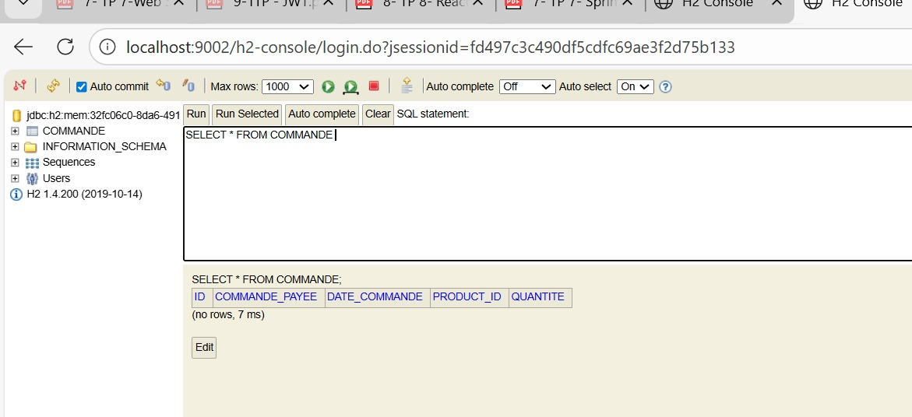
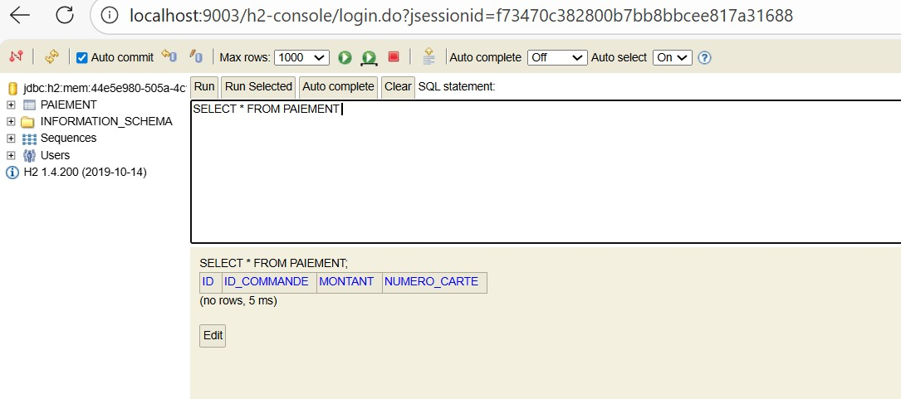
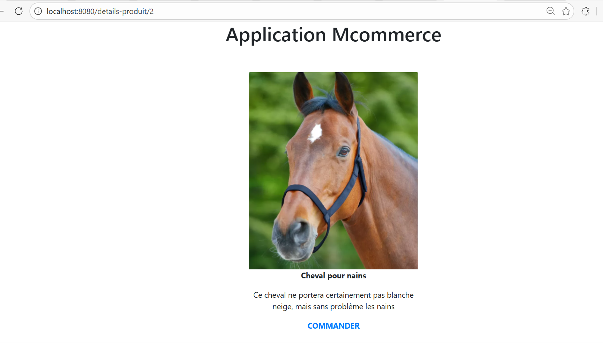
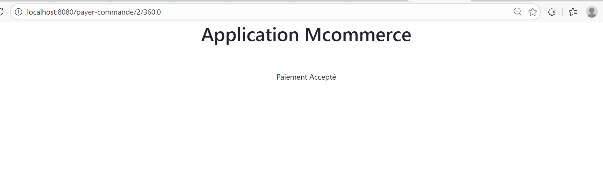
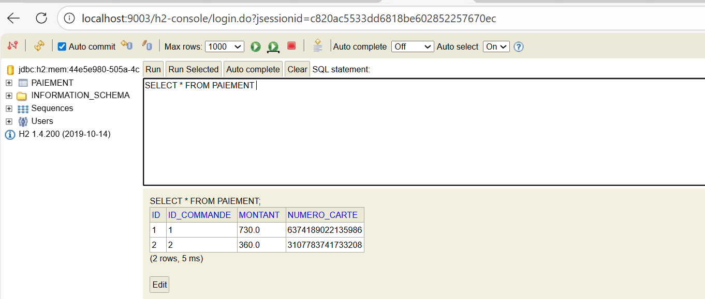

# TP7 – Communication entre microservices avec OpenFeign

## Objectif du TP

Ce TP a pour objectif de mettre en place une application distribuée basée sur plusieurs microservices et de permettre leur communication à l’aide de Spring Cloud OpenFeign.

Les objectifs principaux sont :
- Utiliser OpenFeign pour la communication entre microservices
- Mettre en œuvre les annotations @EnableFeignClients et @FeignClient
- Orchestrer les appels entre les microservices

---

## Description du travail réalisé

L’application est composée de plusieurs microservices :
- clientui (point d’entrée)
- microservice-produits
- microservice-commandes
- microservice-paiement

Le microservice **clientui** joue le rôle d’orchestrateur.  
Il utilise des clients Feign pour appeler les autres microservices afin d’afficher les produits, passer une commande et effectuer un paiement.

---

## Architecture générale

L’utilisateur accède au microservice clientui, qui communique avec les autres microservices via Feign Client.  
Chaque microservice expose des services REST appelés à distance.

---

## Lancement de l’application

Les microservices sont démarrés séparément sur des ports différents.  
Une fois tous les services lancés, l’application est accessible via le microservice clientui.

---

## Captures d’écran

- vérifier le bon fonctionnement :

- Interface de l’application client
  

- Passage de commande  

- Paiement  

---

## Résultat obtenu

Les appels entre microservices fonctionnent correctement grâce à OpenFeign.  
Les données sont échangées sans utiliser directement RestTemplate.

---

## Conclusion

Ce TP permet de mieux comprendre la communication entre microservices et le rôle de Feign Client dans une architecture microservices.
