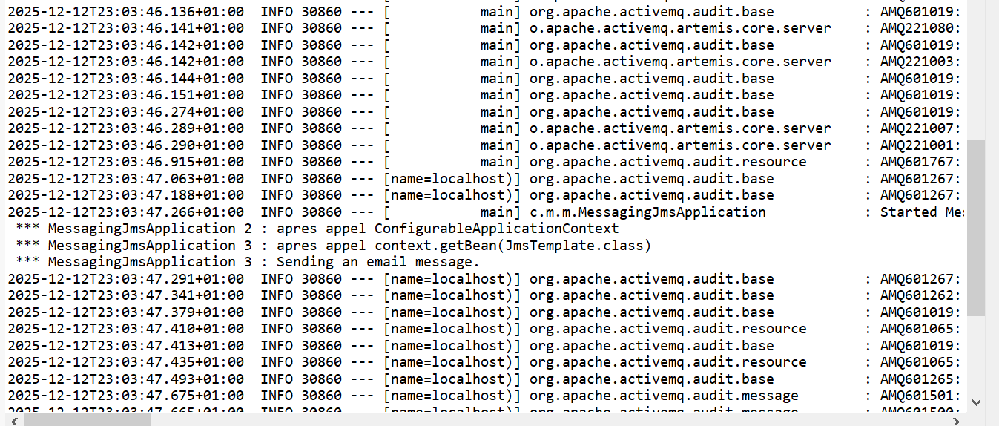
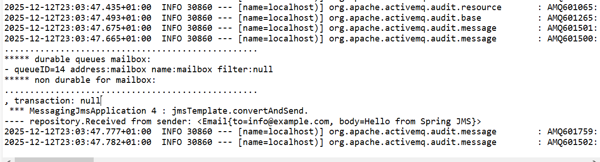

# TP JMS 1 – Communication asynchrone avec Spring Boot et ActiveMQ (Artemis Embedded)

## Objectif du TP
Ce TP a pour objectif de mettre en œuvre le mécanisme de communication asynchrone à l’aide de JMS (Java Message Service) avec Spring Boot et ActiveMQ Artemis en mode embedded.

Il vise à comprendre :
- le démarrage d’un broker de messages intégré à l’application
- l’envoi d’un message JMS à l’aide de JmsTemplate
- la réception asynchrone du message via un listener
- l’utilisation d’une queue JMS durable

---

## Présentation générale
L’application Spring Boot démarre un broker ActiveMQ Artemis en mode embedded.  
Une fois le contexte Spring initialisé, un message de type `Email` est envoyé vers une queue nommée **mailbox**.

Un consumer JMS écoute cette queue et affiche dans la console le message reçu.

---

## Architecture mise en place
L’architecture du TP est composée de :
- une application Spring Boot
- un broker ActiveMQ Artemis embedded
- une queue JMS durable appelée `mailbox`
- un producer JMS chargé de l’envoi du message
- un consumer JMS chargé de la réception du message

La communication entre le producer et le consumer est asynchrone et repose sur JMS.

---

## Démarrage de l’application
Au lancement de l’application, les éléments suivants apparaissent dans la console :
- démarrage de Spring Boot
- initialisation du broker ActiveMQ Artemis
- création des queues système (DLQ, ExpiryQueue)
- activation du serveur de messages

Le message indiquant que le serveur est actif confirme que le broker est correctement démarré.

### Capture 1 – Démarrage de l’application et du broker

---

## Envoi du message JMS (Producer)
Après l’initialisation du contexte Spring :
- le bean `JmsTemplate` est récupéré
- un message de type `Email` est envoyé vers la queue `mailbox`
- la console affiche le message confirmant l’envoi

L’envoi est réalisé à l’aide de la méthode :
`jmsTemplate.convertAndSend("mailbox", email)`

### Capture 2 – Envoi du message JMS

---

## Gestion de la queue JMS
Lors de l’exécution :
- la queue `mailbox` est créée automatiquement
- elle est configurée comme durable
- le message est conservé dans la queue jusqu’à sa consommation

Les informations affichées dans la console confirment la persistance et le routage correct du message.

---

## Réception du message JMS (Consumer)
Un listener JMS est configuré pour écouter la queue `mailbox`.  
Lorsqu’un message est reçu :
- le consumer consomme le message
- un acquittement est effectué
- le contenu de l’objet `Email` est affiché dans la console

Exemple observé :

Received from sender: <Email{to=info@example.com, body=Hello from Spring JMS}>

### Capture 3 – Réception du message JMS

---

## Résultat obtenu
Le message envoyé par le producer est correctement :
- transmis au broker JMS
- stocké dans la queue durable
- consommé par le listener
- affiché dans la console après réception

Le cycle complet d’envoi, de stockage et de réception fonctionne correctement.

---

## Conclusion
Ce TP m’a permis de comprendre le fonctionnement du messaging JMS avec Spring Boot, l’utilisation d’un broker embedded et la communication asynchrone basée sur des queues durables avec ActiveMQ Artemis.
