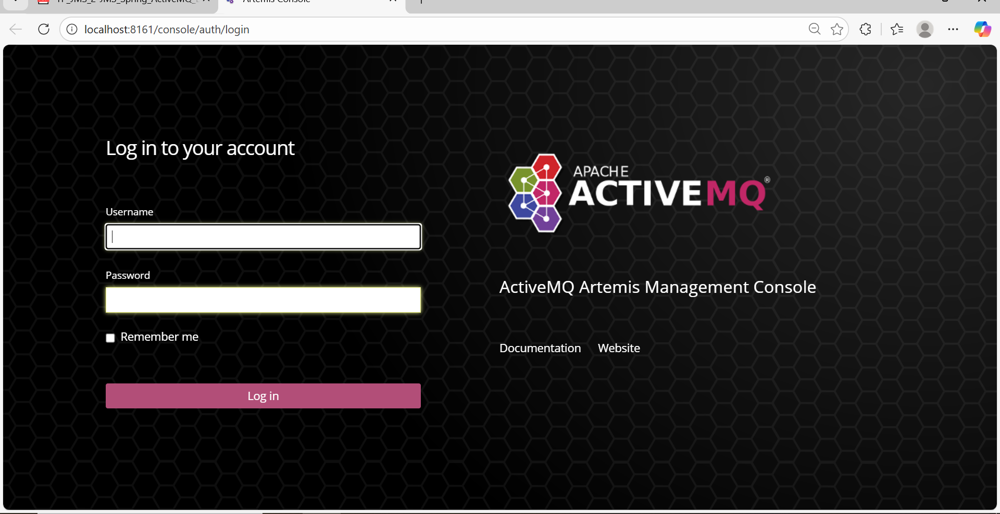
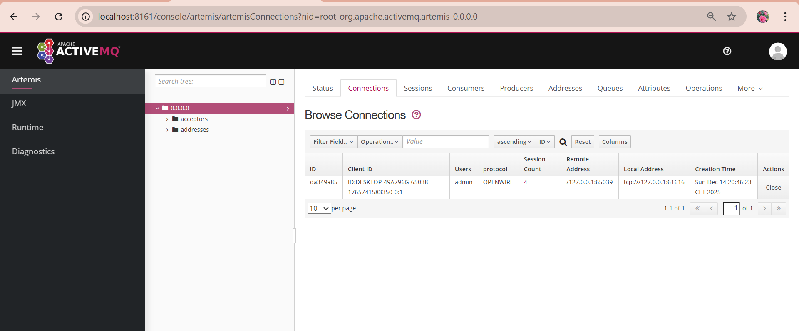
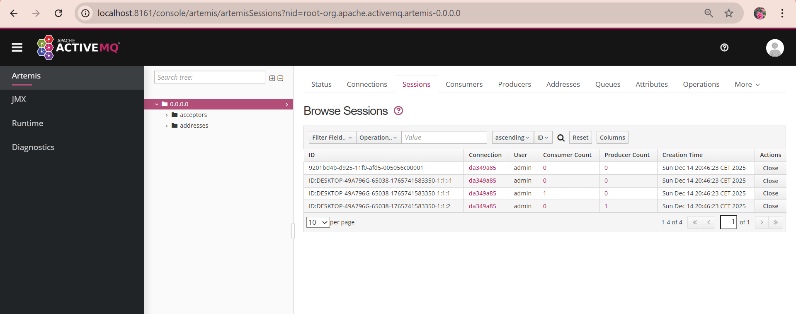
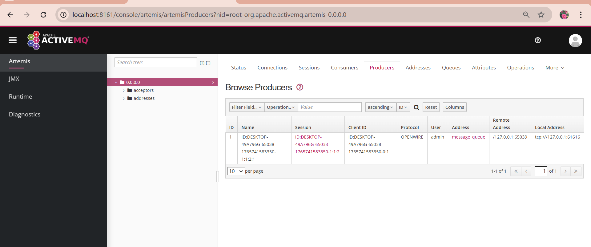
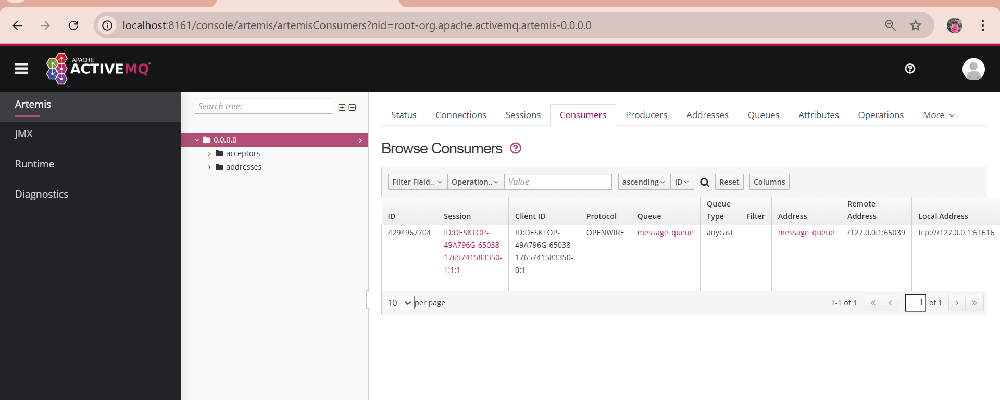
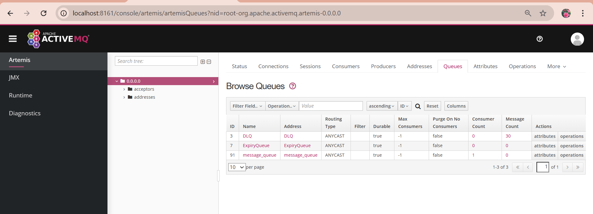
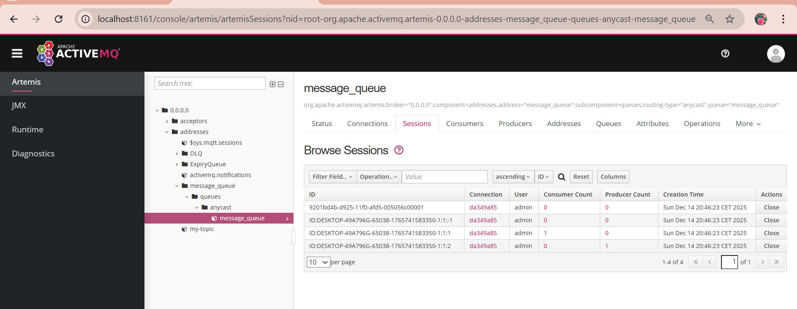
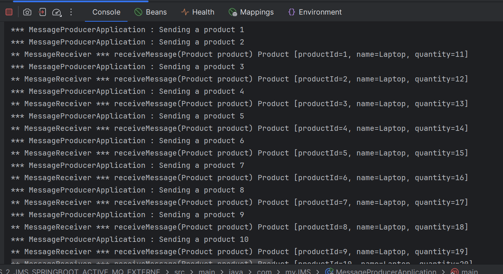

# TP JMS 2 – Spring Boot & ActiveMQ Artemis (Broker externe)

## Objectif du TP

L’objectif de ce TP est de mettre en place une communication asynchrone entre deux applications Spring Boot en utilisant JMS et un broker ActiveMQ Artemis externe.

Ce TP permet de comprendre le rôle d’un broker de messages, la notion de producteur et de consommateur, ainsi que le fonctionnement des files JMS.

---

## Principe général

L’architecture du TP repose sur les éléments suivants :

- Un broker ActiveMQ Artemis lancé séparément
- Une application Spring Boot Producteur
- Une application Spring Boot Consommateur
- Une file JMS appelée `message_queue` (mode ANYCAST)

Le producteur envoie des objets `Product` vers la file, et le consommateur les reçoit automatiquement.

---

## Accès à la console ActiveMQ Artemis

Une fois le broker démarré, la console d’administration est accessible via l’URL suivante :

```

[http://localhost:8161](http://localhost:8161)

````

Cette console permet de superviser les connexions, les sessions, les producteurs, les consommateurs et les files JMS.

### Console ActiveMQ Artemis




---

## Connexions actives

L’onglet **Connections** permet de vérifier que les applications Spring Boot sont bien connectées au broker ActiveMQ Artemis.




---

## Sessions JMS

Dans l’onglet **Sessions**, on peut observer les différentes sessions JMS ouvertes, ainsi que le nombre de producteurs et de consommateurs associés.





---

## Producteurs JMS

La console affiche l’application productrice connectée à la file JMS `message_queue`.
Cela confirme que l’envoi des messages est bien pris en charge par le broker.





---

## Consommateurs JMS

On observe que le consommateur est correctement attaché à la file `message_queue` et qu’il est en écoute permanente.





---

## Files JMS (Queues)

La liste des files JMS disponibles sur le broker est visible dans l’onglet **Queues**.

On y retrouve notamment :

* `message_queue`
* `DLQ`
* `ExpiryQueue`





---

## Détails de la file message_queue

Cette vue permet de vérifier l’état de la file utilisée par les applications, ainsi que le nombre de messages, producteurs et consommateurs.





---

## Console Spring Boot

La console Spring Boot montre clairement :

* l’envoi des messages par le producteur
* la réception des messages par le consommateur

Cela confirme le bon fonctionnement de la communication asynchrone via JMS.





---

## Conclusion

Ce TP m’a permis de comprendre le fonctionnement du messaging JMS avec un broker ActiveMQ Artemis externe, ainsi que la communication asynchrone entre deux applications Spring Boot.

Les messages sont correctement envoyés, reçus et supervisés via la console ActiveMQ, ce qui valide le bon fonctionnement de l’architecture mise en place.
